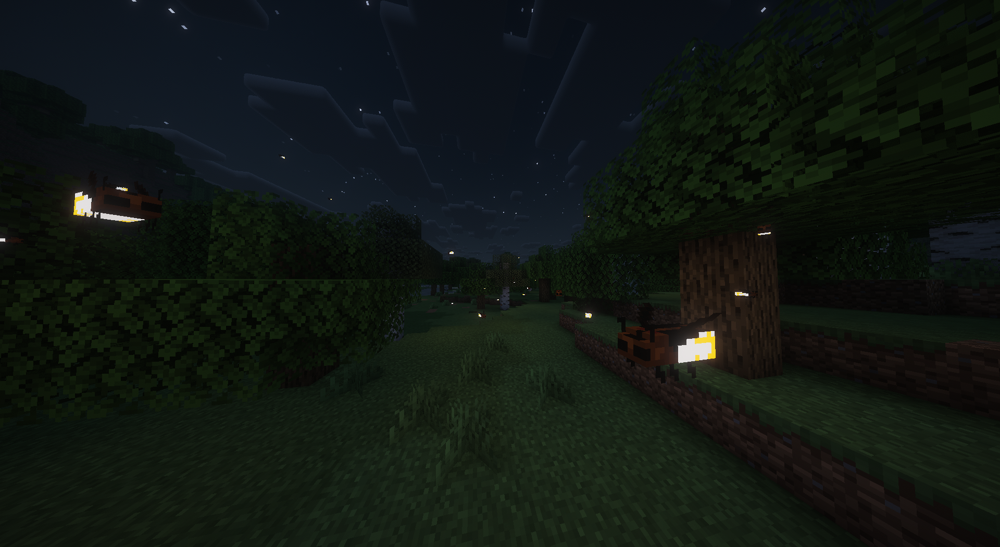

# Better FireFlies (BFF)

**Better FireFlies (BFF)** is an ambient client-side mod that adds beautiful 3D fireflies in various biomes during the night and inside caves.

The fireflies are purely decorative, feature custom glowing models, smooth flying animations, and support seamless dynamic lighting without chunk lag.

  
  

  

---

## 🌲 Spawning Biomes

Fireflies spawn naturally during the night (and in dark caves) across multiple biomes using Minecraft Biome Tags:

- **Forests** (Forest, Birch Forest, Dark Forest, Old Growth)
- **Swamps & Mangroves** (Swamp, Mangrove Swamp, modded swamps)
- **Jungles** (Jungle, Sparse Jungle, Bamboo Jungle)
- **Lush Caves & Dark Caverns** (Underground caverns)
- **Fully compatible with worldgen mods** (*Terralith, Biomes O' Plenty, Regions Unexplored*) via standard tags!

---

## ⚙️ Configuration

A persistent configuration file is located at `config/firefly.json`. Settings are saved automatically across restarts.

You can also use in-game commands:
- `/fireflylight` : Toggle dynamic light emission on / off.
- `/fireflyparticles` : Toggle ambient glow particles on / off.

### 💡 Dynamic Lights Compatibility
For the best visual experience and 144+ FPS performance, install **LambDynamicLights** (Fabric). Better FireFlies smoothly illuminates surrounding blocks through dynamic lighting engines without modifying world blocks!

---

## 📦 Modpacks & License

Feel free to include **Better FireFlies** in any modpack!  
Licensed under the **MIT License**.