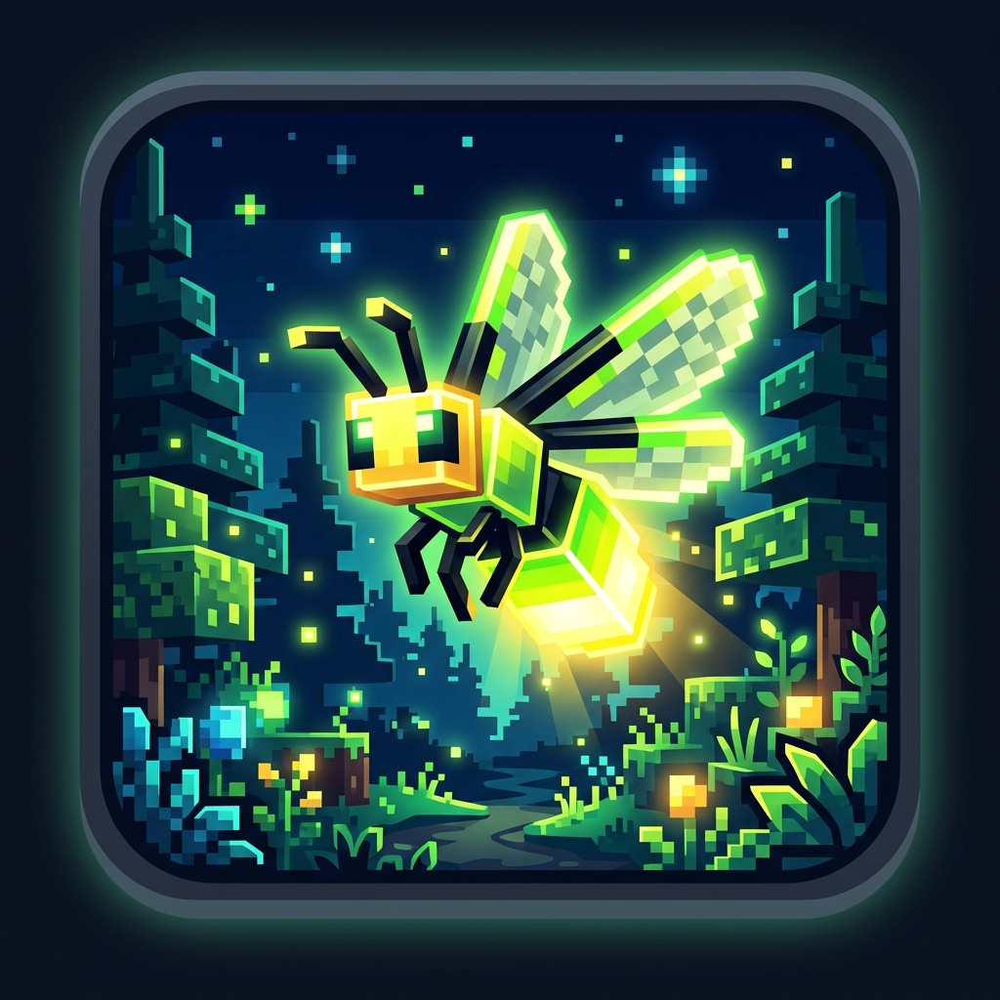

# 🌟 Better FireFlies (BFF)

  
   
  <strong>A modern, atmospheric Minecraft mod adding living bioluminescent fireflies, 3D lantern jars, biome variants, and synchronized swarm breathing.</strong>

  
  
  
  
  

---

## 📸 Screenshots

  
  

  

---

## ✨ Features / Fonctionnalités

### 🫙 1. Firefly in a Jar / Luciole en Bocal
- **3D Decorative Block & Item**: Inspired by lanterns, can be placed on blocks or hung from ceilings (`hanging=true/false`).
- **Animated 2D Fireflies Inside**: Rather than a static cube, 1 to 3 living 2D black-and-yellow firefly particles flutter organically inside the clear glass jar!
- **Waterlogged**: Can be placed underwater safely.
- **Light Level 12**: Illuminates your rooms, paths, and gardens with a soft, warm glow.
- **Capture with a Bottle**: Right-click any wild firefly in the air with an empty **Glass Bottle** (`minecraft:glass_bottle`) to catch it into a Jar!
- **Crafting Table Recipes**:
  - **Top**: Any Wooden Slab (`#minecraft:wooden_slabs`)
  - **Middle**: Glass Bottle (`minecraft:glass_bottle`)
  - **Bottom**: Torch (`minecraft:torch`), Glowstone Dust (`minecraft:glowstone_dust`), or Glow Berries (`minecraft:glow_berries`)

### 🌈 2. Biome Color Variants / Variantes par Biome
Fireflies adapt their bioluminescent color according to the environment:
- 🌲 **Forest**: Vibrant lime green (`#BAF533`)
- 🍂 **Swamp & Mangrove**: Deep warm amber orange (`#FFB733`)
- 🌿 **Lush Caves & Jungle**: Ethereal cyan turquoise (`#33F5D5`)
- 🌸 **Cherry Grove**: Soft sakura pink (`#FF85C8`)

### ✨ 3. Synchronized Swarm Breathing / Pulsation d'Essaim
Just like real fireflies in nature (*Photinus carolinus*), entire swarms harmonize their bioluminescent flashing rhythm, breathing together across the night landscape.

### 💡 4. Real-Time Dynamic Lighting / Lumière Dynamique
- Fireflies cast smooth ambient light on the ground and cave walls as they fly.
- **Zero Chunk Lag**: Cleanly manages lighting with automatic cleanup on despawn, death, or capture.
- **Full Shader & Mod Support**: Compatible with **LambDynamicLights**, **Iris**, and **Sodium** for high-framerate illumination.

### ⚙️ 5. In-Game Commands & Persistent Config
- `/fireflylight` : Toggle dynamic ground lighting on/off in real time.
- `/fireflyparticles` : Toggle ambient glow particles on/off.
- Config is saved across restarts in `config/firefly.json` (`maxFireflies`, `spawnChance`, etc.).

---

## 🌲 Spawning Biomes

Fireflies spawn naturally during the night and in dark caverns:
- **Forests** (`BiomeTags.IS_FOREST`)
- **Jungles** (`BiomeTags.IS_JUNGLE`)
- **Swamps & Mangroves** (`Biomes.SWAMP`, `Biomes.MANGROVE_SWAMP`)
- **Lush Caves** (`Biomes.LUSH_CAVES`)
- **Cherry Groves** (`Biomes.CHERRY_GROVE`)
- **Modded Biomes**: Full plug-and-play support with *Terralith*, *Biomes O' Plenty*, and *Regions Unexplored*!

---

## 📦 Installation & Dependencies

1. Make sure you have **Fabric Loader** (or **Quilt**) installed for Minecraft 1.21+.
2. Download **Fabric API** and place it into your `.minecraft/mods` folder.
3. Download **Better FireFlies** from [Modrinth](https://modrinth.com/mod/firefly) or [CurseForge](https://www.curseforge.com/minecraft/mc-mods/better-fireflies).
4. *(Optional)* Install **LambDynamicLights** for smooth GPU-accelerated dynamic lighting!

---

## 📜 License & Modpacks

- **Better FireFlies** is released under the **MIT License**.
- You are free to include this mod in any modpack on Modrinth, CurseForge, FTB, or private launchers.
